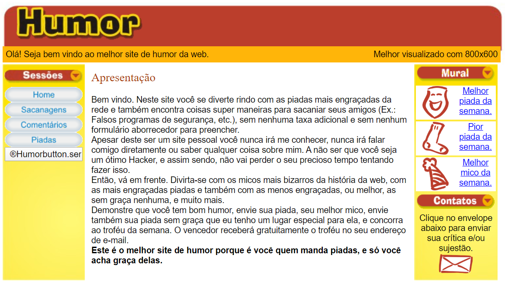
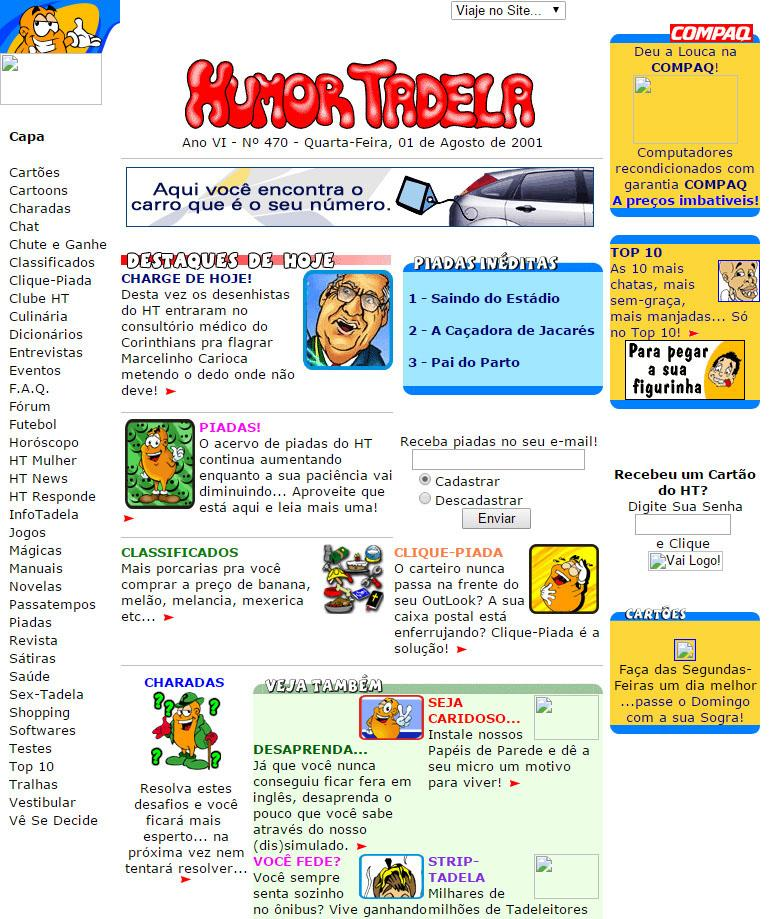

# Humor

Humor foi a minha primeira página em `HTML` mais completa que fiz após algum tempo de estudos.

A data dos arquivos indicam que ela foi feita em 2003, mas eu acredito essa data seja referente ao *backup* que fiz na época e que ela tenha sido feita um pouco antes disso. Eu não tenho a data precisa.

Acesse ao vivo e a cores aqui: [Humor](https://celsojr.github.io/primeira-pagina-html/index.html)

## Inspiração

Essa página foi inspirada em uma dos sites de humor mais populares da época, o Humortadela.

Tinham algumas coisas no site deles que eu não gostava e, ingenuamente, queria melhorar e me tornar um concorrente deles. Eu queria criar uma estrutura para que as pessoas pudessem interagir e se divertir com coisas engraçadas porque essa era a minha pegada na época.

## Extra

Eu criei uma apresentação em *PowerPoint* simulando um sistema de segurança para sacanear a minha tia Cláudia. Tinha até efeitos sonoros. Naquela época, ainda era Windows ME (Millennium edition).

Eu simulei um leitor de digitais e na tela e fiquei morrendo de rir da minha tia com ela botando o dedão na tela daqueles monitores caixotão antigos que nem poderiam imaginar ter uma tecnologia dessas. Mas eu nem sabia que estava meio que prevendo que os *smartphones* de hoje em dia teríam mesmo essa tecnologia.

Essa apresentação encontra-se disponível na pasta **Resources** deste mesmo repo.

## Motivação

Essa minha primeira página foi feita com os recursos disponíveis na época, não tinham as facilidades que temos hoje como editores e as referências *online* eram muito escassas. **Reparou que era tudo feito com tabelas e que usar `div` ao invés disso ainda não era considerado uma boa prática?** Quem tinha dinheiro comprava livros e/ou revistas impressas. Quem não tinha (meu caso), inspecionava o código fonte das páginas da *internet* pelo navegador para tentar aprender alguma na marra nas horas livres.

Por isso, aconselho quem estiver aprendendo a enfrentar as dificuldades com muita força de vontade porque no início tudo é mais difícil mesmo. Com o tempo o `HTML` quase que vira uma piada em si e as coisas começam a se tornar mais fáceis para o seu entendimento.
